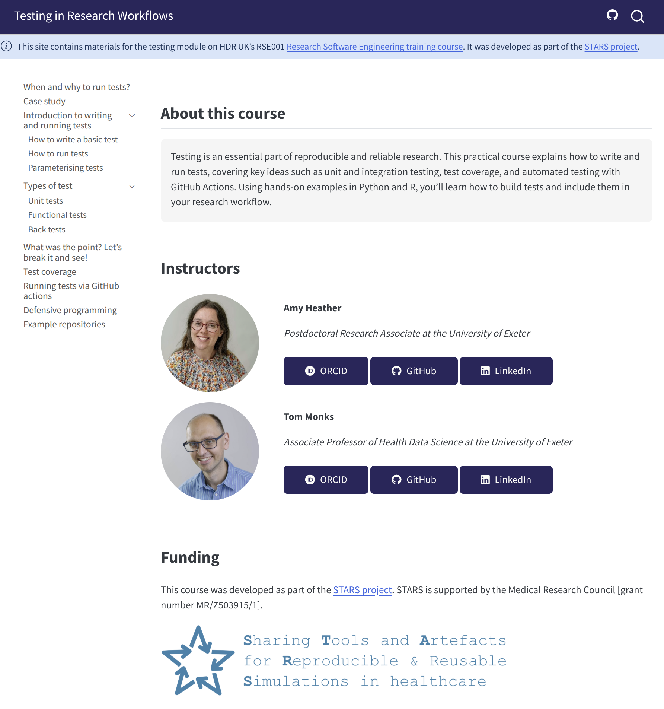

# HDR UK Futures RSE: Testing in Research Workflows

This repository contains code behind our website with materials for the 'Testing in Research Workflows' module on HDR UK's RSE001 <a href='https://hdruklearn.org/courses/course-v1:HDRUK+RSE001+2024' target ='_blank'>Research Software Engineering training course</a>. It was developed as part of the <a href='https://pythonhealthdatascience.github.io/stars/' target='_blank'>STARS project</a>.
    
You can view the website here: <https://pythonhealthdatascience.github.io/hdruk_tests/>

